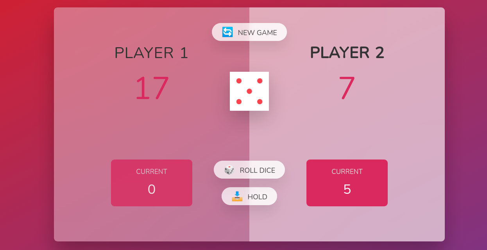

# sturdy_games_javascript

DiceRollGame: This is a simple dice-roll game that is built using the tech-stack that includes javascript, HTML5, CSS3.

About the game: This game includes two players. Each player's score is stored in that respective player's current score before adding it to the player's respective actual total score.
The second player get's chance to roll the dice when the first player's dice roll result value is equal to one, this also clears all the current score values of the first players to zero.

|
