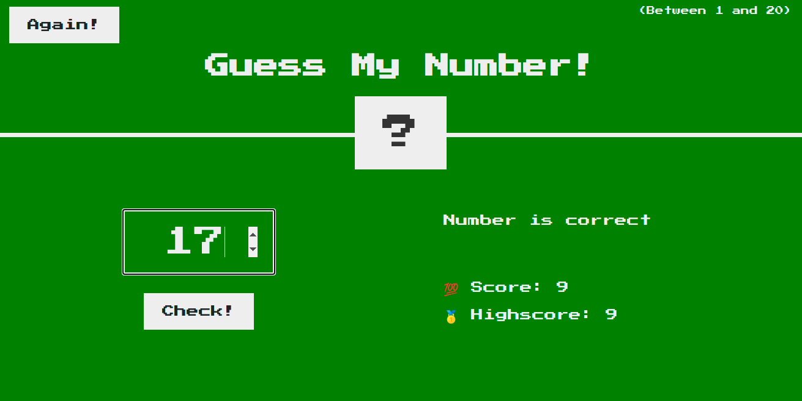

# sturdy_games_javascript

DiceRollGame: This is a simple dice-roll game that is built using the tech-stack that includes 

About the game: This game includes two players. Each player's score is stored in that respective player's current score before adding it to the player's respective actual total score.
The second player get's chance to roll the dice when the first player's dice roll result value is equal to one, this also clears all the current score values of the first players to zero.

|

___________________________________________________________________________________________________________________________________________________________________________________________

GuessMyNumber: This game allows the player to enter the guessed number and check if the entered number matches with the system-generated number or not.
The player is also provided with hints to the user if the entered number is lower or higher than the actual number. The total number of wrong tries can proportionally
affect the user's score. 
The tech-stack used in building this game are javascript, HTML5, CSS3.

|
